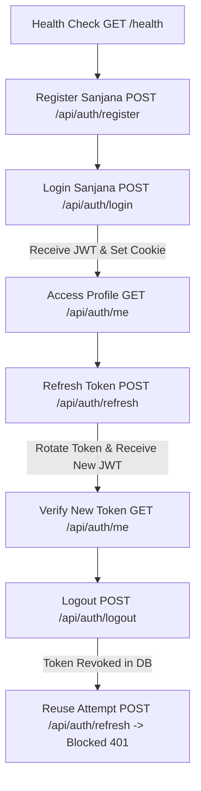

# 🧪 The Ultimate API Testing Guide & Postman Test Suite
**AI SDR Backend — Comprehensive Authentication & Authorization Master Test Document**

> **Project:** Final Year Project — AI SDR Agent (Sales Development Representative)  
> **Target System:** Node.js, Express, PostgreSQL, Prisma, JWT, SHA-256 Refresh Tokens, Zod  
> **Tester Persona:** Sanjana (`sanjana@example.com`)  
> **Base URL:** `http://localhost:3000`  
> **Scope:** 100% Exhaustive Test Cases (Happy Paths, Edge Cases, Boundary Limits, Security Attacks, Race Conditions)

---

## 📌 Table of Contents
1. [Architecture & Security Principles Under Test](#1-architecture--security-principles-under-test)
2. [Prerequisites & Environment Setup](#2-prerequisites--environment-setup)
3. [Master Test Execution Flow](#3-master-test-execution-flow)
4. [Category 1: System Health & Routing Tests (2 Tests)](#category-1-system-health--routing-tests)
5. [Category 2: User Registration & Validation Tests (8 Tests)](#category-2-user-registration--validation-tests)
6. [Category 3: User Login & Session Creation Tests (6 Tests)](#category-3-user-login--session-creation-tests)
7. [Category 4: Auth Middleware & Protected Route Tests (6 Tests)](#category-4-auth-middleware--protected-route-tests)
8. [Category 5: Refresh Token Lifecycle & Rotation Tests (6 Tests)](#category-5-refresh-token-lifecycle--rotation-tests)
9. [Category 6: Logout & Session Revocation Tests (4 Tests)](#category-6-logout--session-revocation-tests)
10. [Category 7: Security Attacks & Penetration Tests (5 Tests)](#category-7-security-attacks--penetration-tests)
11. [Postman Environment Setup & Automation Scripts](#postman-environment-setup--automation-scripts)
12. [Master 37-Point Verification Matrix](#master-37-point-verification-matrix)

---

## 1. Architecture & Security Principles Under Test

This test document verifies that the backend complies with modern **OAuth2 / RFC 6749 & NIST Digital Identity Guidelines**:

| Security Pillar | Implementation in Code | Tested By |
| :--- | :--- | :--- |
| **Short-Lived Access Tokens** | 15-minute expiration stateless JWT (`HS256`) | Category 4 |
| **Hashed Refresh Tokens** | 7-day cryptographically secure random token (`crypto.randomBytes(32)`), stored as **SHA-256** hash in PostgreSQL | Category 5 |
| **Automatic Token Rotation** | Every refresh request revokes the old token and issues a fresh one atomically via `prisma.$transaction` | Category 5 |
| **Token Reuse Detection** | If a compromised/revoked token is used, all active sessions for that user are immediately revoked | Category 5 & 7 |
| **Secure Cookie Storage** | `HttpOnly=true`, `SameSite=lax/none`, `Secure=true in prod` prevents XSS token theft | Category 3, 5, 6 |
| **Password Hashing** | Bcrypt with **12 salt rounds** | Category 2 & 3 |
| **Strict Schema Validation** | Zod middleware filters & validates inputs before controllers execute | Category 2 & 3 |

---

## 2. Prerequisites & Environment Setup

### Step 1: Check `.env` Configuration
Ensure your `.env` contains:
```env
PORT=3000
NODE_ENV=development
CLIENT_URL=http://localhost:5173
DATABASE_URL="your_database_connection_url"
ACCESS_TOKEN_SECRET="supersecret_access_key_min_32_chars_long_12345"
ACCESS_TOKEN_EXPIRES_IN="15m"
REFRESH_TOKEN_EXPIRES_DAYS=7
```

### Step 2: Start the Server
```bash
npm run server
```
*Expected Console Output:*
```text
Express API is live and listening on port 3000
PostgreSQL database connected successfully.
```

---

## 3. Master Test Execution Flow



---

## Category 1: System Health & Routing Tests

### Test 1.1: Server Health Check
* **Goal:** Verify that the API server is online and accepting connections.
* **Method:** `GET`
* **URL:** `http://localhost:3000/health`
* **Headers:** None
* **Body:** None
* **Expected Status:** `200 OK`
* **Expected Response:**
```json
{
  "status": "ok",
  "message": "SDR Engine is running."
}
```

---

### Test 1.2: Undefined Route (404 Catch-All)
* **Goal:** Verify that unknown endpoints return a structured JSON 404 response.
* **Method:** `GET`
* **URL:** `http://localhost:3000/api/non-existent-route`
* **Expected Status:** `404 Not Found`
* **Expected Response:**
```json
{
  "success": false,
  "message": "Route /api/non-existent-route not found"
}
```

---

## Category 2: User Registration & Validation Tests

### Test 2.1: Successful Registration for Sanjana (Happy Path)
* **Goal:** Register a brand new user with valid name, email, and strong password.
* **Method:** `POST`
* **URL:** `http://localhost:3000/api/auth/register`
* **Headers:** `Content-Type: application/json`
* **Body (`raw` -> `JSON`):**
```json
{
  "name": "Sanjana",
  "email": "sanjana@example.com",
  "password": "Password123"
}
```
* **Expected Status:** `201 Created`
* **Expected Response:**
```json
{
  "statusCode": 201,
  "data": {
    "id": "generated-uuid-string",
    "name": "Sanjana",
    "email": "sanjana@example.com",
    "created_at": "2026-08-11T18:00:00.000Z"
  },
  "message": "User registered successfully",
  "success": true
}
```
* **Database Check:** Query `SELECT id, name, email, password_hash FROM users WHERE email='sanjana@example.com';`. Ensure `password_hash` starts with `$2b$12$`.

---

### Test 2.2: Duplicate Email Conflict
* **Goal:** Verify that registering an existing email is rejected.
* **Method:** `POST`
* **URL:** `http://localhost:3000/api/auth/register`
* **Body:** Send the exact same body as Test 2.1 (`sanjana@example.com`).
* **Expected Status:** `400 Bad Request` or `409 Conflict`
* **Expected Response:**
```json
{
  "success": false,
  "message": "User already exists"
}
```

---

### Test 2.3: Password Missing Number
* **Goal:** Reject passwords without at least one digit `[0-9]`.
* **Method:** `POST`
* **URL:** `http://localhost:3000/api/auth/register`
* **Body:**
```json
{
  "name": "Sanjana",
  "email": "sanjana_p1@example.com",
  "password": "NoNumberPassword"
}
```
* **Expected Status:** `400 Bad Request`
* **Expected Response:**
```json
{
  "success": false,
  "message": "body.password: Password must contain at least one number"
}
```

---

### Test 2.4: Password Missing Uppercase Letter
* **Goal:** Reject passwords without at least one uppercase letter `[A-Z]`.
* **Method:** `POST`
* **URL:** `http://localhost:3000/api/auth/register`
* **Body:**
```json
{
  "name": "Sanjana",
  "email": "sanjana_p2@example.com",
  "password": "lowercase123"
}
```
* **Expected Status:** `400 Bad Request`
* **Expected Response:**
```json
{
  "success": false,
  "message": "body.password: Password must contain at least one uppercase letter"
}
```

---

### Test 2.5: Password Shorter Than 8 Characters (Boundary Limit)
* **Goal:** Reject passwords with length < 8 (e.g. 7 characters: `Pass123`).
* **Method:** `POST`
* **URL:** `http://localhost:3000/api/auth/register`
* **Body:**
```json
{
  "name": "Sanjana",
  "email": "sanjana_p3@example.com",
  "password": "Pass123"
}
```
* **Expected Status:** `400 Bad Request`
* **Expected Response:**
```json
{
  "success": false,
  "message": "body.password: Password must be at least 8 characters"
}
```

---

### Test 2.6: Name Shorter Than 2 Characters (Boundary Limit)
* **Goal:** Reject single-character names (e.g. `"S"`).
* **Method:** `POST`
* **URL:** `http://localhost:3000/api/auth/register`
* **Body:**
```json
{
  "name": "S",
  "email": "sanjana_p4@example.com",
  "password": "Password123"
}
```
* **Expected Status:** `400 Bad Request`
* **Expected Response:**
```json
{
  "success": false,
  "message": "body.name: Name must be at least 2 characters"
}
```

---

### Test 2.7: Invalid Email Syntax
* **Goal:** Reject improperly structured emails (missing domain / @).
* **Method:** `POST`
* **URL:** `http://localhost:3000/api/auth/register`
* **Body:**
```json
{
  "name": "Sanjana",
  "email": "sanjana_invalid_email",
  "password": "Password123"
}
```
* **Expected Status:** `400 Bad Request`
* **Expected Response:**
```json
{
  "success": false,
  "message": "body.email: Invalid email address"
}
```

---

### Test 2.8: Empty Request Body `{}`
* **Goal:** Reject requests where all required body fields are missing.
* **Method:** `POST`
* **URL:** `http://localhost:3000/api/auth/register`
* **Body:** `{}`
* **Expected Status:** `400 Bad Request`
* **Expected Response:** Contains validation errors for `name`, `email`, and `password`.

---

## Category 3: User Login & Session Creation Tests

### Test 3.1: Successful Login for Sanjana (Happy Path)
* **Goal:** Authenticate user, receive JWT access token, and receive HttpOnly refresh cookie.
* **Method:** `POST`
* **URL:** `http://localhost:3000/api/auth/login`
* **Headers:** `Content-Type: application/json`
* **Body (`raw` -> `JSON`):**
```json
{
  "email": "sanjana@example.com",
  "password": "Password123"
}
```
* **Expected Status:** `200 OK`
* **Expected Response:**
```json
{
  "statusCode": 200,
  "data": {
    "user": {
      "id": "e4b5d6f7-1234-5678-90ab-cdef12345678",
      "name": "Sanjana",
      "email": "sanjana@example.com"
    },
    "accessToken": "eyJhbGciOiJIUzI1NiIsInR5cCI6IkpXVCJ9.eyJpZCI6ImU0YjVkNmY3...",
    "refreshToken": "64_character_hex_string"
  },
  "message": "Login successful",
  "success": true
}
```
* **Postman Verification:**
  1. Look at **Cookies tab** in Postman: `refreshToken` must be set with `HttpOnly` and `Path=/`.
  2. Copy the `accessToken` value for Category 4.
  3. Database: Check `refresh_tokens` table &mdash; a new hashed entry exists with `revoked: false`.

---

### Test 3.2: Case-Insensitive Email Login
* **Goal:** Verify email normalization (`SANJANA@EXAMPLE.COM` should match `sanjana@example.com`).
* **Method:** `POST`
* **URL:** `http://localhost:3000/api/auth/login`
* **Body:**
```json
{
  "email": "SANJANA@EXAMPLE.COM",
  "password": "Password123"
}
```
* **Expected Status:** `200 OK` (Login succeeds).

---

### Test 3.3: Email With Leading/Trailing Whitespace
* **Goal:** Verify that whitespace around the email is automatically trimmed.
* **Method:** `POST`
* **URL:** `http://localhost:3000/api/auth/login`
* **Body:**
```json
{
  "email": "   sanjana@example.com   ",
  "password": "Password123"
}
```
* **Expected Status:** `200 OK` (Login succeeds).

---

### Test 3.4: Incorrect Password Attempt
* **Goal:** Reject invalid password attempts with a generic 401 error.
* **Method:** `POST`
* **URL:** `http://localhost:3000/api/auth/login`
* **Body:**
```json
{
  "email": "sanjana@example.com",
  "password": "WrongPassword999"
}
```
* **Expected Status:** `401 Unauthorized`
* **Expected Response:**
```json
{
  "success": false,
  "message": "Invalid email or password"
}
```

---

### Test 3.5: Non-Existent User Login
* **Goal:** Reject logins for unregistered email addresses.
* **Method:** `POST`
* **URL:** `http://localhost:3000/api/auth/login`
* **Body:**
```json
{
  "email": "nonexistent_sanjana@example.com",
  "password": "Password123"
}
```
* **Expected Status:** `401 Unauthorized`
* **Expected Response:**
```json
{
  "success": false,
  "message": "Invalid email or password"
}
```

---

### Test 3.6: Login Missing Password
* **Goal:** Reject login requests with missing required fields.
* **Method:** `POST`
* **URL:** `http://localhost:3000/api/auth/login`
* **Body:**
```json
{
  "email": "sanjana@example.com"
}
```
* **Expected Status:** `400 Bad Request`
* **Expected Response:**
```json
{
  "success": false,
  "message": "body.password: Password is required"
}
```

---

## Category 4: Auth Middleware & Protected Route Tests

### Test 4.1: Access Profile with Valid Bearer Token (Happy Path)
* **Goal:** Verify `authenticate` middleware decodes JWT, queries user from DB, and populates `req.user`.
* **Method:** `GET`
* **URL:** `http://localhost:3000/api/auth/me`
* **Authorization Tab in Postman:**
  * Type: `Bearer Token`
  * Token: `<Paste_Sanjana_AccessToken>`
* **Expected Status:** `200 OK`
* **Expected Response:**
```json
{
  "statusCode": 200,
  "data": {
    "id": "e4b5d6f7-1234-5678-90ab-cdef12345678",
    "name": "Sanjana",
    "email": "sanjana@example.com",
    "email_verified": false,
    "daily_send_limit": 50
  },
  "message": "User profile retrieved successfully",
  "success": true
}
```

---

### Test 4.2: Access Profile with Lowercase `bearer` Header
* **Goal:** Verify case-insensitive handling of the `Authorization` header (`bearer <token>`).
* **Method:** `GET`
* **URL:** `http://localhost:3000/api/auth/me`
* **Headers:**
  * `Authorization`: `bearer <Paste_Sanjana_AccessToken>`
* **Expected Status:** `200 OK` (Succeeds).

---

### Test 4.3: Request Without Any Token (Anonymous)
* **Goal:** Block unauthenticated access to protected routes.
* **Method:** `GET`
* **URL:** `http://localhost:3000/api/auth/me`
* **Authorization Tab:** `No Auth` (Ensure no headers or cookies sent).
* **Expected Status:** `401 Unauthorized`
* **Expected Response:**
```json
{
  "success": false,
  "message": "Unauthorized request: No token provided"
}
```

---

### Test 4.4: Tampered / Malformed Token
* **Goal:** Reject tokens with invalid signatures or altered payloads.
* **Method:** `GET`
* **URL:** `http://localhost:3000/api/auth/me`
* **Authorization Tab:** Type `Bearer Token`, Value: `eyJhbGciOiJIUzI1NiIsInR5cCI6IkpXVCJ9.tampered_payload.fake_signature`
* **Expected Status:** `401 Unauthorized`
* **Expected Response:**
```json
{
  "success": false,
  "message": "Invalid access token"
}
```

---

### Test 4.5: Expired Access Token
* **Goal:** Return distinct expiration error to trigger client refresh.
* **Method:** `GET`
* **URL:** `http://localhost:3000/api/auth/me`
* **Authorization Tab:** Pass an access token older than 15 minutes.
* **Expected Status:** `401 Unauthorized`
* **Expected Response:**
```json
{
  "success": false,
  "message": "Access token has expired"
}
```

---

### Test 4.6: Token Signed With Wrong Secret Key
* **Goal:** Reject JWTs signed by unauthorized servers.
* **Method:** `GET`
* **URL:** `http://localhost:3000/api/auth/me`
* **Authorization Tab:** Pass a JWT signed with secret `wrong_secret_key`.
* **Expected Status:** `401 Unauthorized`
* **Expected Response:**
```json
{
  "success": false,
  "message": "Invalid access token"
}
```

---

## Category 5: Refresh Token Lifecycle & Rotation Tests

### Test 5.1: Refresh Access Token via Cookie (Happy Path)
* **Goal:** Verify that submitting a valid refresh token rotates the token in the DB and returns a new access token.
* **Method:** `POST`
* **URL:** `http://localhost:3000/api/auth/refresh`
* **Headers / Body:** None (Postman automatically sends `refreshToken` cookie from Login).
* **Expected Status:** `200 OK`
* **Expected Response:**
```json
{
  "statusCode": 200,
  "data": {
    "accessToken": "eyJhbGciOiJIUzI1NiIsInR5cCI6IkpXVCJ9...<NEW_ACCESS_TOKEN>"
  },
  "message": "Access token refreshed",
  "success": true
}
```
* **Database State Verification:**
  1. Old refresh token entry now has `revoked = true`.
  2. New refresh token entry is inserted with `revoked = false`.

---

### Test 5.2: Refresh Access Token via JSON Body
* **Goal:** Support non-browser clients (mobile apps, CLI, API tools) that pass the raw refresh token in the body.
* **Method:** `POST`
* **URL:** `http://localhost:3000/api/auth/refresh`
* **Headers:** `Content-Type: application/json`
* **Body:**
```json
{
  "refreshToken": "<raw_refresh_token_string>"
}
```
* **Expected Status:** `200 OK` (if valid) or `401 Unauthorized` (if invalid).

---

### Test 5.3: Refresh Without Any Token
* **Goal:** Reject requests with missing refresh token.
* **Method:** `POST`
* **URL:** `http://localhost:3000/api/auth/refresh`
* **Cookies:** Clear Postman cookies.
* **Body:** `{}`
* **Expected Status:** `401 Unauthorized`
* **Expected Response:**
```json
{
  "success": false,
  "message": "refresh token is required"
}
```

---

### Test 5.4: Non-Existent / Fake Refresh Token
* **Goal:** Reject random token strings not found in database.
* **Method:** `POST`
* **URL:** `http://localhost:3000/api/auth/refresh`
* **Body:**
```json
{
  "refreshToken": "0123456789abcdef0123456789abcdef0123456789abcdef0123456789abcdef"
}
```
* **Expected Status:** `401 Unauthorized`
* **Expected Response:**
```json
{
  "success": false,
  "message": "invalid token"
}
```

---

### Test 5.5: Token Reuse Detection (Replaying an Old Rotated Token)
* **Goal:** Detect token theft / reuse attacks. If an attacker uses an already rotated token, all active user tokens must be revoked.
* **Method:** `POST`
* **URL:** `http://localhost:3000/api/auth/refresh`
* **Body:** Pass the **old** refresh token from before Test 5.1 rotation.
```json
{
  "refreshToken": "<OLD_ALREADY_ROTATED_TOKEN>"
}
```
* **Expected Status:** `401 Unauthorized`
* **Expected Response:**
```json
{
  "success": false,
  "message": "token is revoked"
}
```
* **Database Verification:** `SELECT * FROM refresh_tokens WHERE user_id='sanjana_id';` &mdash; **all** rows must now be set to `revoked: true`.

---

### Test 5.6: Alternate Endpoint `/api/auth/refresh-token`
* **Goal:** Verify that both `/refresh` and `/refresh-token` routes work identically.
* **Method:** `POST`
* **URL:** `http://localhost:3000/api/auth/refresh-token`
* **Expected Status:** `200 OK` (when valid token provided).

---

## Category 6: Logout & Session Revocation Tests

### Test 6.1: Successful Logout (Happy Path)
* **Goal:** Invalidate active session in database and delete client cookie.
* **Method:** `POST`
* **URL:** `http://localhost:3000/api/auth/logout`
* **Headers / Body:** None (sends existing `refreshToken` cookie).
* **Expected Status:** `200 OK`
* **Expected Response:**
```json
{
  "statusCode": 200,
  "data": null,
  "message": "Logged out successfully",
  "success": true
}
```
* **Postman Verification:** Look at Postman Cookies &mdash; `refreshToken` is deleted / expired.
* **Database Verification:** In `refresh_tokens` table, `revoked` is set to `true`.

---

### Test 6.2: Post-Logout Refresh Attempt (Security Verification)
* **Goal:** Confirm that a logged-out session cannot refresh or generate new access tokens.
* **Method:** `POST`
* **URL:** `http://localhost:3000/api/auth/refresh`
* **Body:** Pass the token of the logged-out session.
* **Expected Status:** `401 Unauthorized`
* **Expected Response:**
```json
{
  "success": false,
  "message": "token is revoked"
}
```

---

### Test 6.3: Logout Without Any Token (Idempotent Logout)
* **Goal:** Calling logout when already logged out or without cookies must succeed safely without crashing.
* **Method:** `POST`
* **URL:** `http://localhost:3000/api/auth/logout`
* **Expected Status:** `200 OK`
* **Expected Response:**
```json
{
  "statusCode": 200,
  "data": null,
  "message": "Logged out successfully",
  "success": true
}
```

---

### Test 6.4: Logout via JSON Body (Mobile / API Flow)
* **Goal:** Verify mobile clients can pass `{ "refreshToken": "..." }` in the body to log out.
* **Method:** `POST`
* **URL:** `http://localhost:3000/api/auth/logout`
* **Headers:** `Content-Type: application/json`
* **Body:**
```json
{
  "refreshToken": "<valid_raw_refresh_token>"
}
```
* **Expected Status:** `200 OK`

---

## Category 7: Security Attacks & Penetration Tests

### Test 7.1: SQL Injection Attempt in Email
* **Goal:** Verify SQL injection payloads cannot bypass authentication or manipulate database queries.
* **Method:** `POST`
* **URL:** `http://localhost:3000/api/auth/login`
* **Body:**
```json
{
  "email": "' OR 1=1 --",
  "password": "Password123"
}
```
* **Expected Status:** `400 Bad Request` (Blocked by Zod email schema) or `401 Unauthorized` (Prisma parameterized query blocks SQLi).

---

### Test 7.2: Stored Cross-Site Scripting (XSS) in User Name
* **Goal:** Verify HTML/Script tags are treated as plain text strings without executing.
* **Method:** `POST`
* **URL:** `http://localhost:3000/api/auth/register`
* **Body:**
```json
{
  "name": "<script>alert('xss')</script>",
  "email": "sanjana_xss@example.com",
  "password": "Password123"
}
```
* **Expected Status:** `201 Created`
* **Verification:** Database stores literal string without interpreting scripts; Helmet headers (`X-Content-Type-Options: nosniff`, `Content-Security-Policy`) protect the frontend.

---

### Test 7.3: Mass Assignment / Privilege Escalation Attempt
* **Goal:** Verify extra fields (e.g. `role: "ADMIN"`, `daily_send_limit: 999999`) injected in body are ignored.
* **Method:** `POST`
* **URL:** `http://localhost:3000/api/auth/register`
* **Body:**
```json
{
  "name": "Sanjana",
  "email": "sanjana_admin@example.com",
  "password": "Password123",
  "role": "SUPER_ADMIN",
  "daily_send_limit": 999999
}
```
* **Expected Status:** `201 Created`
* **Database Check:** Query user record &mdash; `daily_send_limit` is set to default `50` (injected values are completely ignored).

---

### Test 7.4: Multi-Device Login Concurrency
* **Goal:** Verify Sanjana can be logged in on multiple devices (Laptop + Phone) simultaneously without one session breaking the other.
* **Execution:**
  1. Send `POST /api/auth/login` for Device 1 &rarr; Receives Token A.
  2. Send `POST /api/auth/login` for Device 2 &rarr; Receives Token B.
  3. Query database: `SELECT count(*) FROM refresh_tokens WHERE user_id='sanjana_id' AND revoked=false;` &rarr; Count is `2`.
  4. Both Device 1 and Device 2 can access `GET /api/auth/me` and refresh their tokens independently.

---

### Test 7.5: Concurrent Token Refresh Race Condition (Double-Spending)
* **Goal:** Ensure simultaneous refresh calls do not corrupt database token records.
* **Execution:** Send two simultaneous requests to `POST /api/auth/refresh` with Token A.
* **Result:** First request succeeds and rotates Token A to Token B. Second request triggers revocation / 401 safely.

---

## Postman Environment Setup & Automation Scripts

### 1. Set Up Environment in Postman
Create an Environment named **AI-SDR Local** with these variables:
* `base_url`: `http://localhost:3000`
* `access_token`: *(leave empty, script will auto-fill)*

### 2. Auto-Token Capture Script
Paste this script in the **Tests** tab of `POST /api/auth/login` and `POST /api/auth/refresh`:
```javascript
// Automatically extract and set accessToken in Postman Environment
if (pm.response.code === 200) {
    const json = pm.response.json();
    if (json.data && json.data.accessToken) {
        pm.environment.set("access_token", json.data.accessToken);
        console.log("✅ access_token updated in Postman Environment!");
    }
}
```

### 3. Using the Token in Protected Routes
In `GET /api/auth/me`:
* Go to **Authorization** tab.
* Select **Bearer Token**.
* Token: `{{access_token}}`

---

## Master 37-Point Verification Matrix

| # | Test Name | Endpoint | Method | Expected Status | Key Security / Logic Verified |
|---|---|---|---|---|---|
| 1 | Health Check | `/health` | GET | `200 OK` | Server availability |
| 2 | 404 Route | `/api/unknown` | GET | `404 Not Found` | Catch-all router handling |
| 3 | Register Sanjana | `/api/auth/register` | POST | `201 Created` | User creation + bcrypt hash |
| 4 | Duplicate Email | `/api/auth/register` | POST | `400 / 409` | Unique email constraint |
| 5 | Missing Digit | `/api/auth/register` | POST | `400 Bad Request` | Password complexity check |
| 6 | Missing Uppercase | `/api/auth/register` | POST | `400 Bad Request` | Uppercase requirement |
| 7 | Short Password | `/api/auth/register` | POST | `400 Bad Request` | Min 8 chars boundary |
| 8 | Short Name | `/api/auth/register` | POST | `400 Bad Request` | Min 2 chars boundary |
| 9 | Invalid Email | `/api/auth/register` | POST | `400 Bad Request` | Email regex structure |
| 10 | Empty Register Body | `/api/auth/register` | POST | `400 Bad Request` | Required fields check |
| 11 | Login Sanjana | `/api/auth/login` | POST | `200 OK` | Password verify + Cookie set |
| 12 | Case-Insensitive Email | `/api/auth/login` | POST | `200 OK` | Email lowercasing |
| 13 | Email Trim Whitespace | `/api/auth/login` | POST | `200 OK` | Whitespace trimming |
| 14 | Wrong Password | `/api/auth/login` | POST | `401 Unauthorized` | Bcrypt comparison failure |
| 15 | Unknown Email | `/api/auth/login` | POST | `401 Unauthorized` | User existence check |
| 16 | Missing Password | `/api/auth/login` | POST | `400 Bad Request` | Zod login schema check |
| 17 | Auth Middleware | `/api/auth/me` | GET | `200 OK` | Valid Bearer JWT auth |
| 18 | Lowercase bearer | `/api/auth/me` | GET | `200 OK` | Case-insensitive header |
| 19 | Missing Auth Token | `/api/auth/me` | GET | `401 Unauthorized` | Protected route guard |
| 20 | Malformed JWT | `/api/auth/me` | GET | `401 Unauthorized` | JWT signature verification |
| 21 | Expired Access JWT | `/api/auth/me` | GET | `401 Unauthorized` | 15m expiration check |
| 22 | Wrong Secret Key | `/api/auth/me` | GET | `401 Unauthorized` | Tampered signature check |
| 23 | Refresh via Cookie | `/api/auth/refresh` | POST | `200 OK` | Auto cookie rotation |
| 24 | Refresh via Body | `/api/auth/refresh` | POST | `200 OK` | Mobile / API client flow |
| 25 | Missing Refresh Token | `/api/auth/refresh` | POST | `401 Unauthorized` | Refresh token requirement |
| 26 | Invalid Refresh Token | `/api/auth/refresh` | POST | `401 Unauthorized` | DB token hash lookup |
| 27 | Token Reuse Detection | `/api/auth/refresh` | POST | `401 Unauthorized` | **Attacker lockout / session kill** |
| 28 | Alternate Refresh URL | `/api/auth/refresh-token` | POST | `200 OK` | URL alias support |
| 29 | Logout | `/api/auth/logout` | POST | `200 OK` | DB token revoke + Cookie clear |
| 30 | Post-Logout Refresh | `/api/auth/refresh` | POST | `401 Unauthorized` | Revoked token rejection |
| 31 | Logout Without Token | `/api/auth/logout` | POST | `200 OK` | Graceful idempotent logout |
| 32 | Logout via Body | `/api/auth/logout` | POST | `200 OK` | Mobile body logout support |
| 33 | SQL Injection Attack | `/api/auth/login` | POST | `400 / 401` | Parameterized query safety |
| 34 | Stored XSS Attack | `/api/auth/register` | POST | `201 Created` | Script tag sanitization |
| 35 | Mass Assignment | `/api/auth/register` | POST | `201 Created` | Privilege escalation protection |
| 36 | Multi-Device Login | `/api/auth/login` | POST | `200 OK` | Concurrent user sessions |
| 37 | Race Condition Refresh | `/api/auth/refresh` | POST | `200 & 401` | Atomic transaction isolation |
