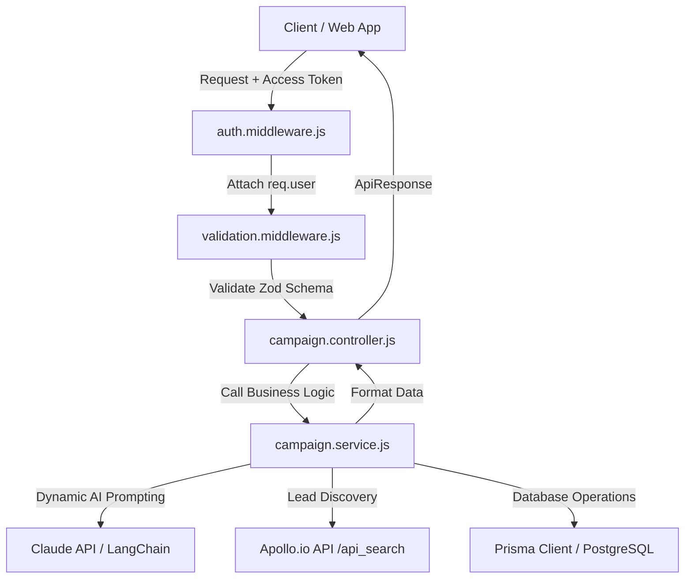

# 🎯 AI SDR Agent — Campaign & Lead Outreach Master Blueprint & API Specification (`campaign.md`)

> **Project:** Multi-Tenant AI Sales Development Representative (AI SDR)  
> **Module:** Campaign Orchestration, AI Lead Search & Fit Scoring, Ingestion & Analytics  
> **Tech Stack:** Node.js, Express.js, PostgreSQL, Prisma ORM, Zod, my-async-handler, Claude 3.5 / LangChain, Apollo.io API  
> **Target Path:** `learning_material/campaign.md`

---

## 📌 Table of Contents
1. [Architecture & Multi-Tenant Rules](#1-architecture--multi-tenant-rules)
2. [Database Schema Reference](#2-database-schema-reference)
3. [Layered Component Design & Workflow](#3-layered-component-design--workflow)
4. [Zod Validation Schemas Specification](#4-zod-validation-schemas-specification)
5. [API Controller & Service Architecture](#5-api-controller--service-architecture)
6. [Step-by-Step API Endpoints Specification](#6-step-by-step-api-endpoints-specification)
7. [Apollo.io & Claude AI Integration Workflow](#7-apolloio--claude-ai-integration-workflow)
8. [Master Postman Test Suite & cURL Reference](#8-master-postman-test-suite--curl-reference)

---

## 1. Architecture & Multi-Tenant Rules

### 🔐 Strict Multi-Tenant Isolation
1. **User Scoping (`req.user.id`)**:
   - Every single campaign request MUST originate from an authenticated user context attached to `req.user` by `authenticate` middleware.
   - Campaign queries MUST explicitly filter using `where: { id: campaignId, user_id: req.user.id }` to eliminate cross-tenant access vulnerabilities.
2. **Campaign-Lead Scoping (`campaign_id`)**:
   - Leads belong directly to a specific campaign (`campaign_id`).
   - Adding, modifying, or querying leads requires verifying that the target campaign belongs to `req.user.id`.
3. **No Hardcoded Criteria**:
   - Target audiences, job titles, industries, company size thresholds, product value propositions, and prompt templates are stored dynamically inside the `Campaign` model (`product_description`, `value_props`, `search_criteria`).

### 🛠️ Core Code Standards
- **Routing**: `src/modules/campaigns/campaign.routes.js`
- **Validation**: `validation(schema)` middleware wrapping Zod schemas.
- **Async Handling**: Every controller method is wrapped with `asyncHandler` from `my-async-handler`.
- **Response Format**: `return res.status(code).json(new ApiResponse(code, data, message))`
- **Error Handling**: `throw new ApiError(statusCode, message)`

---

## 2. Database Schema Reference

The Campaign module interacts primarily with the `Campaign`, `CampaignAnalytics`, `Lead`, `LeadResearch`, and `AiJob` models:

```prisma
enum CampaignStatus {
  DRAFT
  ACTIVE
  PAUSED
  COMPLETED
  ARCHIVED
}

enum LeadSource {
  MANUAL
  APOLLO
  LINKEDIN
  CSV_IMPORT
  WEBHOOK
  OTHER
}

enum LeadStatus {
  NEW
  RESEARCHING
  RESEARCHED
  CONTACTED
  REPLIED
  INTERESTED
  NOT_INTERESTED
  BOUNCED
  OPTED_OUT
  UNQUALIFIED
}

model Campaign {
  id                  String         @id @default(uuid())
  user_id             String
  name                String
  product_description String         @db.Text
  value_props         Json
  search_criteria     Json
  tone                String
  status              CampaignStatus @default(DRAFT)
  created_at          DateTime       @default(now())
  updated_at          DateTime       @updatedAt
  deleted_at          DateTime?

  user      User               @relation(fields: [user_id], references: [id], onDelete: Cascade)
  analytics CampaignAnalytics?
  leads     Lead[]

  @@index([user_id])
  @@map("campaigns")
}

model CampaignAnalytics {
  id          String   @id @default(uuid())
  campaign_id String   @unique
  total_leads Int      @default(0)
  emails_sent Int      @default(0)
  replies     Int      @default(0)
  interested  Int      @default(0)
  bounced     Int      @default(0)
  updated_at  DateTime @updatedAt

  campaign Campaign @relation(fields: [campaign_id], references: [id], onDelete: Cascade)

  @@map("campaign_analytics")
}

model Lead {
  id          String     @id @default(uuid())
  campaign_id String
  full_name   String
  email       String
  company     String?
  job_title   String?
  linkedin    String?
  source      LeadSource @default(MANUAL)
  status      LeadStatus @default(NEW)
  fit_score   Int?
  created_at  DateTime   @default(now())
  updated_at  DateTime   @updatedAt

  campaign      Campaign       @relation(fields: [campaign_id], references: [id], onDelete: Cascade)
  lead_research LeadResearch[]
  emails        Email[]
  follow_ups    FollowUp[]
  ai_jobs       AiJob[]
  notifications Notification[]

  @@index([campaign_id])
  @@index([email])
  @@map("leads")
}
```

---

## 3. Layered Component Design & Workflow



---

## 4. Zod Validation Schemas Specification

File Location: `src/schemas/campaign.schema.js`

```javascript
import { z } from "zod";
import { CampaignStatus, LeadSource } from "@prisma/client";

// Search criteria shape
const searchCriteriaSchema = z.object({
  job_titles: z.array(z.string()).min(1, "At least one job title is required"),
  industry_keywords: z.array(z.string()).min(1, "At least one industry keyword is required"),
  company_sizes: z.array(z.string()).min(1, "At least one company size range is required"),
  locations: z.array(z.string()).min(1, "At least one location is required")
});

// 1. Suggest Targeting Schema
export const suggestTargetingSchema = z.object({
  body: z.object({
    product_description: z.string().min(10, "Product description must be at least 10 characters"),
    value_props: z.array(z.string()).min(1, "At least one value proposition is required"),
    tone: z.enum(["Direct", "Casual", "Formal"])
  })
});

// 2. Create Draft Campaign Schema
export const createCampaignSchema = z.object({
  body: z.object({
    name: z.string().min(3, "Campaign name must be at least 3 characters"),
    product_description: z.string().min(10, "Product description must be at least 10 characters"),
    value_props: z.array(z.string()).min(1, "At least one value proposition is required"),
    tone: z.enum(["Direct", "Casual", "Formal"]),
    search_criteria: searchCriteriaSchema
  })
});

// 3. Discover Leads Schema
export const discoverLeadsSchema = z.object({
  body: z.object({
    search_criteria: searchCriteriaSchema
  })
});

// 4. Batch Ingest Leads Schema
export const batchIngestLeadsSchema = z.object({
  params: z.object({
    id: z.string().uuid("Invalid campaign ID format")
  }),
  body: z.object({
    leads: z.array(
      z.object({
        full_name: z.string().min(1, "Full name is required"),
        email: z.string().email("Invalid email address"),
        company: z.string().nullable().optional(),
        job_title: z.string().nullable().optional(),
        linkedin: z.string().url("Invalid LinkedIn URL").nullable().optional(),
        source: z.nativeEnum(LeadSource).default(LeadSource.APOLLO),
        fit_score: z.number().int().min(1).max(100).nullable().optional()
      })
    ).min(1, "Provide at least one lead for batch ingestion")
  })
});

// 5. Manual Lead Ingestion Schema
export const manualIngestLeadSchema = z.object({
  params: z.object({
    id: z.string().uuid("Invalid campaign ID format")
  }),
  body: z.object({
    full_name: z.string().min(1, "Full name is required"),
    email: z.string().email("Invalid email address"),
    company: z.string().optional(),
    job_title: z.string().optional(),
    linkedin: z.string().url("Invalid LinkedIn URL").optional()
  })
});

// 6. Update Campaign Status Schema
export const updateCampaignStatusSchema = z.object({
  params: z.object({
    id: z.string().uuid("Invalid campaign ID format")
  }),
  body: z.object({
    status: z.nativeEnum(CampaignStatus)
  })
});

// 7. Get Campaigns Query Schema
export const getCampaignsQuerySchema = z.object({
  query: z.object({
    search: z.string().optional(),
    status: z.nativeEnum(CampaignStatus).optional(),
    page: z.string().regex(/^\d+$/).transform(Number).optional().default("1"),
    limit: z.string().regex(/^\d+$/).transform(Number).optional().default("10")
  })
});
```

---

## 5. API Controller & Service Architecture

### Routes Definition (`src/modules/campaigns/campaign.routes.js`)
```javascript
import { Router } from "express";
import { authenticate, requireVerifiedEmail } from "../../middleware/auth.middleware.js";
import { validation } from "../../middleware/validation.middleware.js";
import {
  getRecentCampaigns,
  getCampaigns,
  suggestTargeting,
  createCampaign,
  discoverLeads,
  batchIngestLeads,
  manualIngestLead,
  updateStatus
} from "./campaign.controller.js";
import {
  suggestTargetingSchema,
  createCampaignSchema,
  discoverLeadsSchema,
  batchIngestLeadsSchema,
  manualIngestLeadSchema,
  updateCampaignStatusSchema,
  getCampaignsQuerySchema
} from "../../schemas/campaign.schema.js";

const router = Router();

// Protect all campaign routes
router.use(authenticate);

// Recent Campaigns (Dashboard)
router.get("/recent", getRecentCampaigns);

// Paginated Campaigns Search & List
router.get("/", validation(getCampaignsQuerySchema), getCampaigns);

// Step 1: AI Targeting Suggestions
router.post("/suggest-targeting", validation(suggestTargetingSchema), suggestTargeting);

// Step 1: Create Draft Campaign
router.post("/", requireVerifiedEmail, validation(createCampaignSchema), createCampaign);

// Step 2: Discover Leads via Apollo + AI Fit Scoring
router.post("/discover-leads", validation(discoverLeadsSchema), discoverLeads);

// Step 3: Batch Ingest Discovered Leads
router.post("/:id/leads/batch", validation(batchIngestLeadsSchema), batchIngestLeads);

// Step 3: Manual Lead Ingestion
router.post("/:id/leads/manual", validation(manualIngestLeadSchema), manualIngestLead);

// Step 3 / Operations: Update Status
router.patch("/:id/status", validation(updateCampaignStatusSchema), updateStatus);

export default router;
```

---

## 6. Step-by-Step API Endpoints Specification

### 1. `GET /api/campaigns/recent`
- **Purpose**: Fetch top 10 most recent campaigns for dashboard quick stats.
- **Service Logic**:
  ```javascript
  export const fetchRecentCampaignsService = async (userId) => {
    return await prisma.campaign.findMany({
      where: { user_id: userId, deleted_at: null },
      take: 10,
      orderBy: { created_at: "desc" },
      include: {
        analytics: true,
        _count: { select: { leads: true } }
      }
    });
  };
  ```

### 2. `GET /api/campaigns?search=&status=&page=1&limit=10`
- **Purpose**: Paginated search and filtering across user's campaigns.
- **Service Logic**:
  ```javascript
  export const fetchCampaignsService = async (userId, { search, status, page = 1, limit = 10 }) => {
    const skip = (page - 1) * limit;
    const where = {
      user_id: userId,
      deleted_at: null,
      ...(status && { status }),
      ...(search && {
        OR: [
          { name: { contains: search, mode: "insensitive" } },
          { product_description: { contains: search, mode: "insensitive" } }
        ]
      })
    };

    const [total, campaigns] = await prisma.$transaction([
      prisma.campaign.count({ where }),
      prisma.campaign.findMany({
        where,
        skip,
        take: limit,
        orderBy: { created_at: "desc" },
        include: { analytics: true }
      })
    ]);

    return {
      campaigns,
      pagination: {
        total,
        page,
        limit,
        totalPages: Math.ceil(total / limit)
      }
    };
  };
  ```

### 3. `POST /api/campaigns/suggest-targeting`
- **Purpose**: Uses Claude AI to analyze product description, value props, and tone to generate structured search filters.
- **Expected Input**:
  ```json
  {
    "product_description": "AI-powered CRM workflow automation for enterprise B2B sales teams.",
    "value_props": ["Reduces lead research time by 80%", "Automates hyper-personalized outreach"],
    "tone": "Direct"
  }
  ```
- **Expected Response**:
  ```json
  {
    "statusCode": 200,
    "message": "AI targeting suggestions generated successfully",
    "data": {
      "job_titles": ["VP of Sales", "Head of Business Development", "Sales Operations Director"],
      "industry_keywords": ["Software Development", "Information Technology", "SaaS"],
      "company_sizes": ["51-200", "201-500", "501-1000"],
      "locations": ["United States", "Canada", "United Kingdom"]
    },
    "success": true
  }
  ```

### 4. `POST /api/campaigns`
- **Purpose**: Create a `DRAFT` Campaign with zeroed analytics.
- **Expected Input**:
  ```json
  {
    "name": "Q3 SaaS Outreach Campaign",
    "product_description": "AI-powered CRM workflow automation for enterprise B2B sales teams.",
    "value_props": ["Reduces lead research time by 80%", "Automates hyper-personalized outreach"],
    "tone": "Direct",
    "search_criteria": {
      "job_titles": ["VP of Sales", "Sales Director"],
      "industry_keywords": ["Computer Software", "Internet"],
      "company_sizes": ["51-200"],
      "locations": ["United States"]
    }
  }
  ```
- **Service Transaction Logic**:
  ```javascript
  export const createCampaignService = async (userId, data) => {
    return await prisma.$transaction(async (tx) => {
      const campaign = await tx.campaign.create({
        data: {
          user_id: userId,
          name: data.name,
          product_description: data.product_description,
          value_props: data.value_props,
          search_criteria: data.search_criteria,
          tone: data.tone,
          status: "DRAFT"
        }
      });

      await tx.campaignAnalytics.create({
        data: {
          campaign_id: campaign.id,
          total_leads: 0,
          emails_sent: 0,
          replies: 0,
          interested: 0,
          bounced: 0
        }
      });

      return campaign;
    });
  };
  ```

### 5. `POST /api/campaigns/discover-leads`
- **Purpose**: Queries Apollo.io API with approved criteria, scores leads using Claude AI, returns ~50 candidate leads with `fit_score` and `ai_reason`.
- **Expected Response**:
  ```json
  {
    "statusCode": 200,
    "message": "Leads discovered and scored successfully",
    "data": [
      {
        "full_name": "Sarah Connor",
        "email": "s.connor@cyberdyne.io",
        "company": "Cyberdyne Systems",
        "job_title": "VP of Sales Operations",
        "linkedin": "https://linkedin.com/in/sarah-connor-sales",
        "fit_score": 94,
        "ai_reason": "High-tier VP role in target company size and software sector."
      }
    ],
    "success": true
  }
  ```

### 6. `POST /api/campaigns/:id/leads/batch`
- **Purpose**: Batch insert user-selected leads and update `CampaignAnalytics.total_leads`.
- **Service Transaction Logic**:
  ```javascript
  export const batchIngestLeadsService = async (userId, campaignId, leads) => {
    return await prisma.$transaction(async (tx) => {
      // 1. Verify Campaign ownership
      const campaign = await tx.campaign.findFirst({
        where: { id: campaignId, user_id: userId, deleted_at: null }
      });
      if (!campaign) throw new ApiError(404, "Campaign not found or access denied");

      // 2. Prepare Lead Data
      const leadRecords = leads.map(lead => ({
        campaign_id: campaignId,
        full_name: lead.full_name,
        email: lead.email,
        company: lead.company || null,
        job_title: lead.job_title || null,
        linkedin: lead.linkedin || null,
        source: lead.source || "APOLLO",
        fit_score: lead.fit_score || null,
        status: "NEW"
      }));

      // 3. Batch Create
      const created = await tx.lead.createMany({ data: leadRecords });

      // 4. Increment Total Leads in Analytics
      await tx.campaignAnalytics.update({
        where: { campaign_id: campaignId },
        data: { total_leads: { increment: created.count } }
      });

      return { ingested_count: created.count };
    });
  };
  ```

### 7. `POST /api/campaigns/:id/leads/manual`
- **Purpose**: Manually add a single lead to campaign.
- **Service Transaction Logic**:
  ```javascript
  export const manualIngestLeadService = async (userId, campaignId, leadData) => {
    return await prisma.$transaction(async (tx) => {
      const campaign = await tx.campaign.findFirst({
        where: { id: campaignId, user_id: userId, deleted_at: null }
      });
      if (!campaign) throw new ApiError(404, "Campaign not found or access denied");

      const lead = await tx.lead.create({
        data: {
          campaign_id: campaignId,
          full_name: leadData.full_name,
          email: leadData.email,
          company: leadData.company || null,
          job_title: leadData.job_title || null,
          linkedin: leadData.linkedin || null,
          source: "MANUAL",
          status: "NEW"
        }
      });

      await tx.campaignAnalytics.update({
        where: { campaign_id: campaignId },
        data: { total_leads: { increment: 1 } }
      });

      return lead;
    });
  };
  ```

### 8. `PATCH /api/campaigns/:id/status`
- **Purpose**: Change campaign status (`ACTIVE`, `PAUSED`, `COMPLETED`, `ARCHIVED`).
- **Service Logic**:
  ```javascript
  export const updateCampaignStatusService = async (userId, campaignId, status) => {
    const campaign = await prisma.campaign.findFirst({
      where: { id: campaignId, user_id: userId, deleted_at: null }
    });
    if (!campaign) throw new ApiError(404, "Campaign not found or access denied");

    return await prisma.campaign.update({
      where: { id: campaignId },
      data: { status }
    });
  };
  ```

---

## 7. Apollo.io & Claude AI Integration Workflow

### 🤖 Claude AI Prompt for Search Criteria Suggestion
```text
System: You are an expert B2B SDR AI strategist.
Input:
- Product Description: {{product_description}}
- Value Propositions: {{value_props}}
- Tone: {{tone}}

Task: Output a valid JSON object strictly matching this schema:
{
  "job_titles": ["string"],
  "industry_keywords": ["string"],
  "company_sizes": ["string"],
  "locations": ["string"]
}
```

### 📡 Apollo API Query Translation
```javascript
// Mapping search_criteria to Apollo POST /v1/mixed_people/search payload
const apolloPayload = {
  api_key: process.env.APOLLO_API_KEY,
  person_titles: searchCriteria.job_titles,
  organization_num_employees_ranges: searchCriteria.company_sizes,
  person_locations: searchCriteria.locations,
  page: 1,
  per_page: 50
};
```

---

## 8. Master Postman Test Suite & cURL Reference

### Test 1: Generate AI Targeting Suggestions
```bash
curl -X POST http://localhost:3000/api/campaigns/suggest-targeting \
  -H "Authorization: Bearer <ACCESS_TOKEN>" \
  -H "Content-Type: application/json" \
  -d '{
    "product_description": "AI-powered SDR assistant that automates personalized email sequences for B2B sales.",
    "value_props": ["Increases reply rates by 3x", "Saves 15 hours per SDR weekly"],
    "tone": "Direct"
  }'
```

### Test 2: Create Campaign (Draft)
```bash
curl -X POST http://localhost:3000/api/campaigns \
  -H "Authorization: Bearer <ACCESS_TOKEN>" \
  -H "Content-Type: application/json" \
  -d '{
    "name": "Q3 Enterprise Tech Campaign",
    "product_description": "AI-powered SDR assistant that automates personalized email sequences for B2B sales.",
    "value_props": ["Increases reply rates by 3x", "Saves 15 hours per SDR weekly"],
    "tone": "Direct",
    "search_criteria": {
      "job_titles": ["VP of Sales", "Chief Revenue Officer"],
      "industry_keywords": ["Software", "SaaS"],
      "company_sizes": ["51-200"],
      "locations": ["United States"]
    }
  }'
```

### Test 3: Discover & Score Leads
```bash
curl -X POST http://localhost:3000/api/campaigns/discover-leads \
  -H "Authorization: Bearer <ACCESS_TOKEN>" \
  -H "Content-Type: application/json" \
  -d '{
    "search_criteria": {
      "job_titles": ["VP of Sales"],
      "industry_keywords": ["Software"],
      "company_sizes": ["51-200"],
      "locations": ["United States"]
    }
  }'
```

### Test 4: Batch Ingest Discovered Leads
```bash
curl -X POST http://localhost:3000/api/campaigns/<CAMPAIGN_ID>/leads/batch \
  -H "Authorization: Bearer <ACCESS_TOKEN>" \
  -H "Content-Type: application/json" \
  -d '{
    "leads": [
      {
        "full_name": "Alex Mercer",
        "email": "alex.mercer@techcorp.io",
        "company": "TechCorp",
        "job_title": "VP of Sales",
        "linkedin": "https://linkedin.com/in/alex-mercer",
        "fit_score": 92,
        "source": "APOLLO"
      }
    ]
  }'
```

### Test 5: Activate Campaign
```bash
curl -X PATCH http://localhost:3000/api/campaigns/<CAMPAIGN_ID>/status \
  -H "Authorization: Bearer <ACCESS_TOKEN>" \
  -H "Content-Type: application/json" \
  -d '{
    "status": "ACTIVE"
  }'
```

---
*Created strictly per requirement in `learning_material/campaign.md`.*
